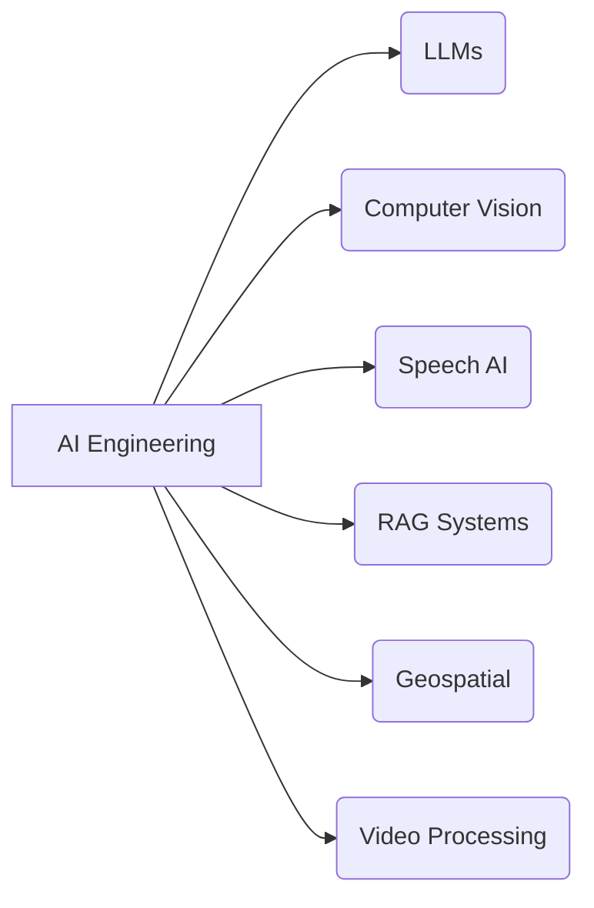
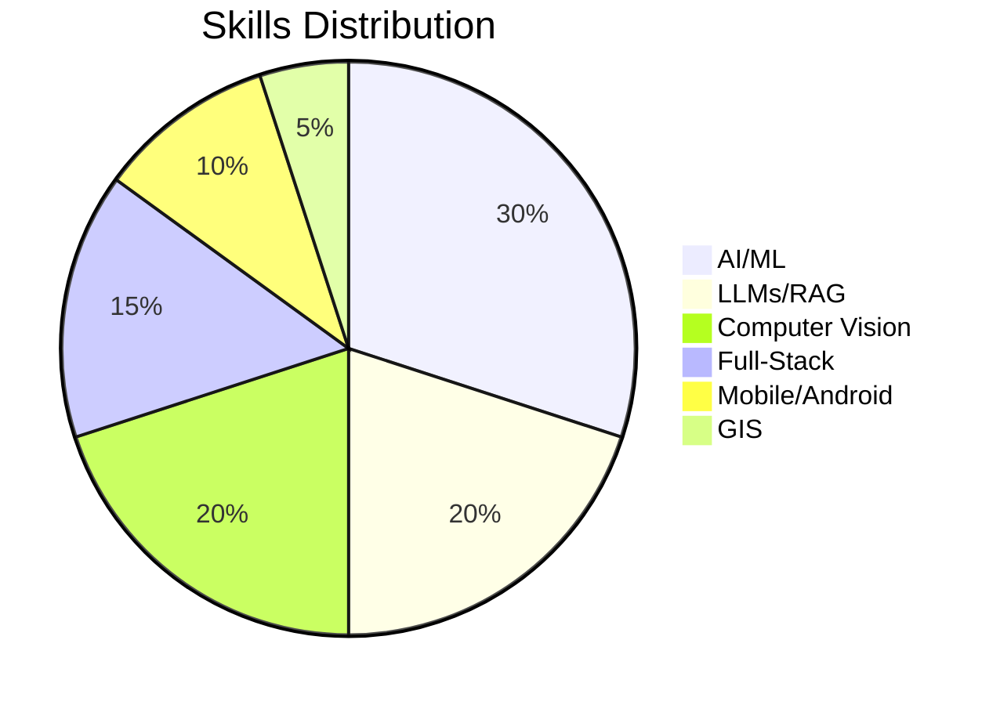

# 👋 Hi, I'm **Muhammad Irfan**

### AI Engineer | Computer Vision | LLMs | Full‑Stack Product Builder

I build **AI-powered products** end‑to‑end — from data pipelines and machine learning models to full-stack deployment, APIs, cloud infrastructure, and mobile/computer vision applications.

My work spans:

* 🎙️ **Voicebots & Speech AI**
* 🤖 **LLM-based workflow automation**
* 🧠 **RAG systems & embeddings**
* 🛰️ **Geospatial analysis (GEE, QGIS)**
* 📱 **Mobile AI (Android, React Native)**
* 🎥 **AI video processing, TTS, and media intelligence**
* 🖼️ **Image matching, feature extraction, and AR**
* 🛠️ **Full-stack development (Next.js, Prisma, MySQL, AngularJS)**

---

## 🚀 **What I’m Building / Recent Work**

### **1. AI Voicebot SaaS**

* Custom voicebots for businesses
* Real‑time conversation, intent detection, contextual memory
* API integrations for CRM, scheduling, invoicing

### **2. Video → Shorts AI Tool (MVP)**

* Auto‑detection of highlight moments
* Intelligent cut detection
* Auto‑captions, transitions, template‑based layout
* Built pipeline for speech‑to‑text + LLM chunking + editing

### **3. Media Monitoring Platform**

* Speech-to-text + OCR for news tickers
* Topic classification using LLMs
* Sentiment & headline analysis
* Dashboard and alert system

### **4. Mobile AR + Vector Search (Android)**

* Kotlin + ObjectBox vector DB
* Real‑time feature extraction & matching
* Video frame–based querying and overlay

### **5. PDF → Audiobook Agent**

* Chapter-wise extraction
* Speech synthesis using Orpheus‑TTS
* Summaries, highlights, structured content output

---

## 📊 **My Skills Overview**

### **Languages & Tools**

| Category            | Tools / Tech                                                                        |
| ------------------- | ----------------------------------------------------------------------------------- |
| **AI/ML**           | PyTorch, TensorFlow Lite, scikit-learn, XGBoost, Milvus, FAISS, ObjectBox Vector DB |
| **LLMs**            | OpenAI, Ollama, Transformers, RAG, embedding pipelines                              |
| **Speech**          | Orpheus‑TTS, Whisper, VAD, diarization                                              |
| **Computer Vision** | OpenCV, LoFTR, LightGlue, Kornia, image matching                                    |
| **Mobile**          | Android (Kotlin), React Native                                                      |
| **Full‑Stack**      | Next.js, AngularJS, Prisma, MySQL, Tailwind, JWT                                    |
| **Cloud/DevOps**    | Azure, Docker, FastAPI, REST APIs                                                   |
| **GIS**             | Google Earth Engine, QGIS, Raster/Vector analysis                                   |

---

## 📈 Experience Snapshot

---

## 🧪 Featured Projects

### **🔍 AI Feature Matching Engine (LoFTR + LightGlue)**

* Reduced feature count for performance
* Added ObjectBox-based vector search
* Enabled real-time AR overlay in Android

### **🗂️ Search Console Content Workflow**

* Live data pipeline using `searchconsole` package
* Automated content briefs & NLP-driven writing flow

### **🌡️ GEE Heatmap Analysis for Islamabad**

* LST & LULC classification
* Multi-year raster comparison
* Automated map exporting

### **🎧 Voice‑Interactive Chat Widget for Websites**

* Uses *heygen/streaming-avatar*
* Next.js front-end + secure token backend
* WordPress embeddable widget

---

## 🌐 Social Links

* **Email:** [virtuoso.irfan@gmail.com](mailto:virtuoso.irfan@gmail.com)
* **LinkedIn:** [https://www.linkedin.com/in/mirfan899/](https://www.linkedin.com/in/mirfan899/)

---

## 📬 Let's Work Together

If you're building something with:

* AI automation
* RAG + LLMs
* Voice or video AI
* Android vision apps
* Geospatial analysis

I’d love to collaborate.

Reach out anytime! 🚀
