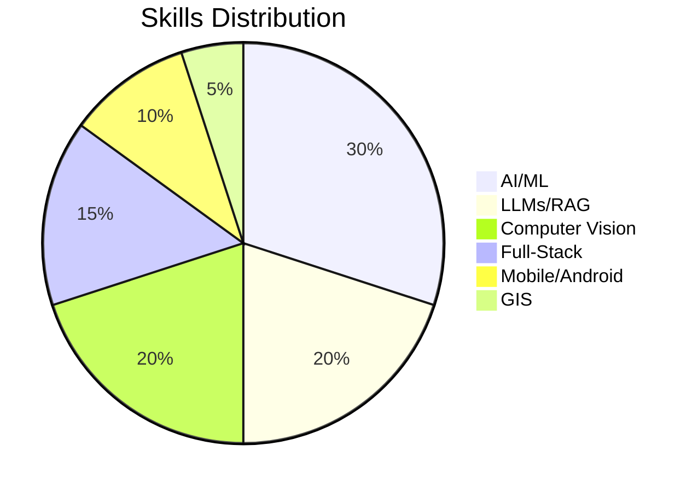

# 👋 Hi, I'm **Muhammad Irfan**

### AI Engineer | Computer Vision | LLMs | Full‑Stack Product Builder

I build **AI-powered products** end‑to‑end — from data pipelines and machine learning models to full-stack deployment, APIs, cloud infrastructure, and mobile/computer vision applications.

My work spans:

* 🎙️ **Voicebots & Speech AI**
* 🤖 **LLM-based workflow automation**
* 🧠 **RAG systems & embeddings**
* 🛰️ **Geospatial analysis (GEE, QGIS)**
* 📱 **Mobile AI (Android, React Native)**
* 🎥 **AI video processing, TTS, and media intelligence**
* 🖼️ **Image matching, feature extraction, and AR**
* 🛠️ **Full-stack development (Next.js, Prisma, MySQL, AngularJS)**

---

## 🚀 **What I’m Building / Recent Work**

### **1. AI Voicebot SaaS**

* Custom voicebots for businesses
* Real‑time conversation, intent detection, contextual memory
* API integrations for CRM, scheduling, invoicing

### **2. Video → Shorts AI Tool (MVP)**

* Auto‑detection of highlight moments
* Intelligent cut detection
* Auto‑captions, transitions, template‑based layout
* Built pipeline for speech‑to‑text + LLM chunking + editing

### **3. Media Monitoring Platform**

* Speech-to-text + OCR for news tickers
* Topic classification using LLMs
* Sentiment & headline analysis
* Dashboard and alert system

### **4. Mobile AR + Vector Search (Android)**

* Kotlin + ObjectBox vector DB
* Real‑time feature extraction & matching
* Video frame–based querying and overlay

### **5. PDF → Audiobook Agent**

* Chapter-wise extraction
* Speech synthesis using Orpheus‑TTS
* Summaries, highlights, structured content output

---

## 🚀 Core Skills

| Skill | Level |
|-------|-------|
| **AI / ML** |  |
| **LLMs / RAG** |  |
| **Computer Vision** |  |
| **Full-Stack** |  |
| **Mobile / Android** |  |
| **Speech / TTS** |  |
| **Video Processing** |  |

### **Languages & Tools**

**AI / ML**  
 
 
 
 
 
 

**LLMs**  
 
 
 
 

**Speech**  
 
 
 

**Computer Vision**  
 
 
 
 

**Mobile**  
 

**Full-Stack**  
 
 
 
 
 

**Cloud / DevOps**  
 
 
 

**GIS**  
 
 

---

## 📈 Experience Snapshot

```mermaid
pie title Skills Distribution
  "AI/ML" : 30
  "LLMs/RAG" : 20
  "Computer Vision" : 20
  "Full‑Stack" : 15
  "Mobile/Android" : 10
  "GIS" : 5
```

---

## 📊 GitHub Stats

---

## 🏆 GitHub Trophies

## 📌 Tech Stack Badges

### **Languages & Frameworks**

  
  
  
  

### **AI & ML Tools**

  
  
  
  

### **Full‑Stack & Cloud**

  
  
  
  

---

## 🌐 Social Links

* **Email:** [virtuoso.irfan@gmail.com](mailto:virtuoso.irfan@gmail.com)
* **LinkedIn:** [https://www.linkedin.com/in/mirfan899/](https://www.linkedin.com/in/mirfan899/)

---

## 📬 Let's Work Together

If you're building something with:

* AI automation
* RAG + LLMs
* Voice or video AI
* Android vision apps
* Geospatial analysis

I’d love to collaborate.

Reach out anytime! 🚀
